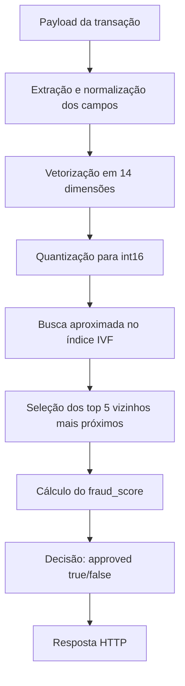
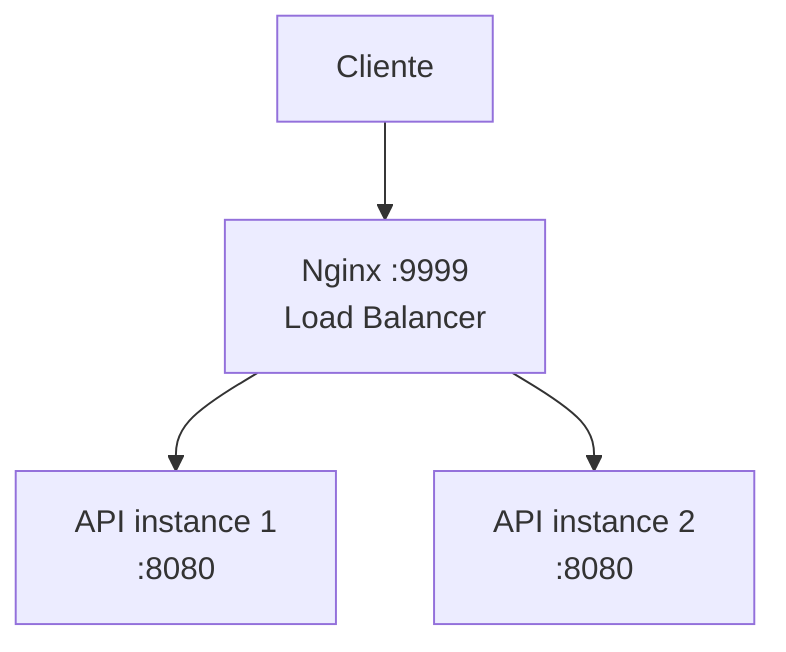

# RB-2026-IVF uma abordagem para o desafio da Rinha de Backend 2026

<!-- Resumo -->
API de detecção de fraude desenvolvida em C++ para a Rinha de Backend 2026.

A solução implementa um serviço HTTP de baixa latência que recebe transações de cartão, transforma o payload em um vetor normalizado de 14 dimensões e realiza busca vetorial aproximada usando um índice IVF customizado. O objetivo é retornar uma decisão de aprovação ou recusa respeitando as restrições de CPU, memória e arquitetura do desafio.
<!-- Visão geral -->
## Visão Geral

Este projeto foi desenvolvido para explorar técnicas de performance de backend em um cenário com restrições reais de infraestrutura. A API precisa responder às requisições no endpoint `/fraud-score` com:

```
{ 
    "approved": <true/false>,
    "fraud_score": <score>
}
```
Com esse objetivo, a solução executa o seguinte fluxo:



<!-- Decisões técnicas -->
## Decisões técnicas

A primeira decisão foi manter a API em C++20 usando `uWebSockets`, com duas instâncias atrás do Nginx. No início o Nginx fazia o balanceamento como proxy HTTP/L7, mas depois foi alterado para `stream` TCP/L4 para reduzir o overhead na frente das APIs.

O payload recebido no endpoint é transformado em um vetor normalizado de 14 dimensões. Essa vetorização concentra as variáveis numéricas, categóricas e booleanas em uma representação única para permitir comparação por distância.

A primeira implementação de busca usava kNN direto sobre as referências. O `mcc_risk.json` passou a ficar em cache em memória, evitando releitura durante as requisições. Também foi criado um pré-processamento do `references.json.gz` no build da imagem para tirar parse e descompressão do runtime.

Esse pré-processamento inicialmente gerava um `references.bin`. A ideia era mudar o layout das referências para um formato binário mais eficiente, carregar o arquivo via `mmap` e evitar custo de alocação/parsing na subida da API. Nessa fase, os vetores de referência foram quantizados para `uint8_t`, o cálculo de distância passou a usar AVX2 e o top-k foi otimizado com array fixo em vez de uma estrutura mais pesada.

Depois disso foram criados buckets para reduzir o espaço de busca do kNN. Os buckets foram ajustados algumas vezes, inclusive com redução da flag para 1 bit, mas a abordagem acabou sendo substituída por um IVF-Flat customizado.

Com o IVF, o pré-processamento passou a gerar `references.ivf`, não mais `references.bin`. O build treina k-means para gerar os centróides e escreve o índice com header, centróides, offsets, vetores e labels. Em runtime, a busca seleciona as `nprobe` melhores listas invertidas e limita a quantidade de candidatos com `candidate_cap`.

A quantização dos vetores foi alterada de `uint8_t` para `int16_t`, preservando mais informação nas distâncias sem voltar para `float` em runtime. O `references.ivf` também é carregado via `mmap`; no startup, a API usa `madvise` e `warmReferences()` para aquecer o índice antes de responder `/ready`.

No endpoint `/fraud-score`, a resposta JSON é montada manualmente para reduzir overhead de serialização. O build também foi ajustado para performance com `-O3`, `-march=haswell`, `-mtune=haswell`, `-mavx2`, `-funroll-loops` e LTO.

Os parâmetros finais do IVF ficam configuráveis pelo `docker-compose`, incluindo `nlist`, `sample_size`, `iterations`, `nprobe` e `candidate_cap`. Também existem parâmetros de fallback, `RB_IVF_FALLBACK_NPROBE` e `RB_IVF_FALLBACK_CANDIDATE_CAP`, para aumentar a busca quando o caminho principal não encontra candidatos suficientes.

<!-- Arquitetura -->
## Arquitetura

A solução segue a arquitetura exigida pela Rinha:



O Nginx atua apenas como load balancer. A lógica de detecção fica exclusivamente nas instâncias da API.
<!-- Stack -->
## Stack utilizada
- C++20
- uWebSockets
- nlohmann-json
- Boost iostreams
- CMake
- vcpkg
- Docker
- Docker Compose
- Nginx
- AVX2
- mmap
<!-- Endpoints -->
## Endpoints

A API pública está exposta pelo Nginx na porta `9999`. As instâncias C++ escutam internamente na porta `8080` o load balancer só redireciona as requisições.

### `GET /ready`

Endpoint de prontidão usado pela engine da Rinha antes do teste de carga. Quando a aplicação terminar de carregar os dados de referência e estiver pronta para receber requisições, responde `HTTP 200` com JSON:

```json
{"status":"ready"}
```

### `POST /fraud-score`

Endpoint principal de detecção de fraude. Recebe uma transação de cartão em JSON, transforma o payload em um vetor normalizado de 14 dimensões e consulta o índice IVF para estimar os 5 vizinhos mais próximos.

Payload esperado:

```json
{
  "id": "tx-3576980410",
  "transaction": {
    "amount": 384.88,
    "installments": 3,
    "requested_at": "2026-03-11T20:23:35Z"
  },
  "customer": {
    "avg_amount": 769.76,
    "tx_count_24h": 3,
    "known_merchants": ["MERC-009", "MERC-001"]
  },
  "merchant": {
    "id": "MERC-001",
    "mcc": "5912",
    "avg_amount": 298.95
  },
  "terminal": {
    "is_online": false,
    "card_present": true,
    "km_from_home": 13.7090520965
  },
  "last_transaction": {
    "timestamp": "2026-03-11T14:58:35Z",
    "km_from_current": 18.8626479774
  }
}
```

`last_transaction` também pode ser `null`. Nesse caso, as dimensões `minutes_since_last_tx` e `km_from_last_tx` usam o valor sentinela `-1`.

Resposta esperada:

```json
{
  "approved": false,
  "fraud_score": 1.0
}
```

O `fraud_score` representa a fração de fraudes entre os 5 vizinhos mais próximos. A decisão segue o threshold oficial do desafio:

```text
approved = fraud_score < 0.6
```

Na prática, os scores possíveis são `0.0`, `0.2`, `0.4`, `0.6`, `0.8` e `1.0`.

<!-- Limitações -->
## Limitações do desafio

- A API pública deve expor exatamente os endpoints `GET /ready` e `POST /fraud-score` na porta `9999`.
- A arquitetura deve ter pelo menos um load balancer e duas instâncias de API. O load balancer não pode aplicar lógica de negócio, inspecionar payloads, transformar requisições ou responder no lugar da API.
- A soma dos recursos declarados no `docker-compose` não pode passar de `1 CPU` e `350 MB` de memória. Nesta solução, o compose distribui `0.20 CPU / 50 MB` para o Nginx e `0.40 CPU / 150 MB` para cada uma das duas réplicas da API.
- O modo de rede deve ser `bridge`; `network_mode: host` e `privileged` não são permitidos para a submissão.
- As imagens usadas na submissão precisam estar públicas e ser compatíveis com `linux-amd64`.
- O dataset de referência contém 3.000.000 vetores rotulados em 14 dimensões. Ele pode ser pré-processado no build ou no startup, mas os payloads do teste não podem ser usados como lookup ou base de referência.
- O teste considera erro qualquer resposta de `/fraud-score` diferente de `HTTP 200`. Erros HTTP pesam mais na pontuação que falsos positivos e falsos negativos.
- As requisições do teste de carga têm timeout de aproximadamente `2001ms`; p99 acima de `2000ms` aciona o corte de latência, e mais de `15%` de falhas aciona o corte de detecção.

<!-- Como executar -->
## Como Executar
```shell
docker compose build
docker compose up -d
``` 

<!-- Resultados -->
## Resultados

Os resultados abaixo são da prévia da submissão.

Submissão testada:

- Repositório: `https://github.com/jvsouzx/rb-2026-ivf`
- Imagem do Nginx: `nginx:alpine`
- Imagem da API: `ghcr.io/jvsouzx/rb-2026-ivf:0.0.4`
- Commit: `db88e84`
- Recursos: `1 CPU` e `350 MB`

Resumo do dataset da prévia:

| Métrica | Valor |
| --- | ---: |
| Total de transações | `54100` |
| Fraudes esperadas | `23959` |
| Legítimas esperadas | `30141` |
| Taxa de fraude | `44.29%` |
| Taxa de legítimas | `55.71%` |
| Edge cases | `645` |
| Taxa de edge cases | `1.19%` |

Resultado geral:

| Métrica | Valor |
| --- | ---: |
| Score final | `5473.7191` |
| Score de latência p99 | `2564.0281` |
| Score de detecção | `2909.6910` |
| p99 | `2.7288 ms` |
| HTTP errors | `0` |
| Failure rate | `0.0018%` |
| Error rate epsilon | `0.00185%` |
| Weighted errors E | `1` |
| Componente de taxa da detecção | `3000` |
| Penalidade absoluta da detecção | `-90.3090` |

Breakdown da detecção:

| Métrica | Valor |
| --- | ---: |
| True positives | `23942` |
| True negatives | `30116` |
| False positives | `1` |
| False negatives | `0` |

Nenhum corte foi acionado na prévia: tanto o corte de latência quanto o corte de detecção ficaram como `false`.

Runtime validado pela engine:

| Serviço | CPU | Memória |
| --- | ---: | ---: |
| Nginx | `0.20` | `50 MB` |
| API 1 | `0.40` | `150 MB` |
| API 2 | `0.40` | `150 MB` |
