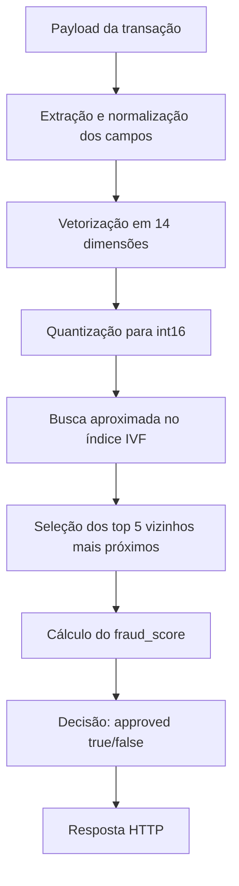
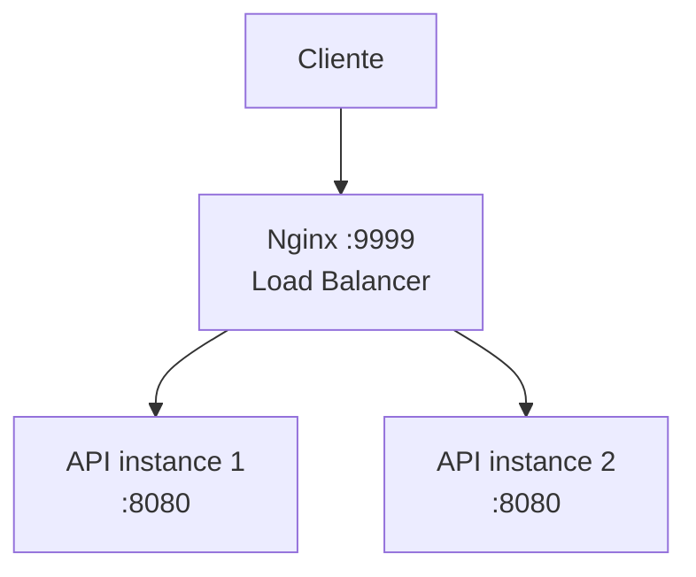

# RB-2026-IVF uma abordagem para o desafio da Rinha de Backend 2026

<!-- Resumo -->
API de detecção de fraude desenvolvida em C++ para a Rinha de Backend 2026.

A solução implementa um serviço HTTP de baixa latência que recebe transações de cartão, transforma o payload em um vetor normalizado de 14 dimensões e realiza busca vetorial aproximada usando um índice IVF customizado. O objetivo é retornar uma decisão de aprovação ou recusa respeitando as restrições de CPU, memória e arquitetura do desafio.
<!-- Visão geral -->
## Visão Geral

Este projeto foi desenvolvido para explorar técnicas de performance de backend em um cenário com restrições reais de infraestrutura. A API precisa responder às requisições no endpoint `/fraud-score` com:

```
{ 
    "approved": <true/false>,
    "fraud_score": <score>
}
```
Com esse objetivo, a solução executa o seguinte fluxo:



<!-- Decisões técnicas -->
<!-- Arquitetura -->
## Arquitetura

A solução segue a arquitetura exigida pela Rinha:



O Nginx atua apenas como load balancer. A lógica de detecção fica exclusivamente nas instâncias da API.
<!-- Stack -->
## Stack utilizada
- C++20
- uWebSockets
- nlohmann-json
- Boost iostreams
- CMake
- vcpkg
- Docker
- Docker Compose
- Nginx
- AVX2
- mmap
<!-- Endpoints -->
<!-- Como executar -->
<!-- Benchmark -->
<!-- Parâmetros de tuning -->
<!-- Estratégia de busca -->
<!-- Resultados -->
<!-- Aprendizados -->
<!-- Próximos passos -->